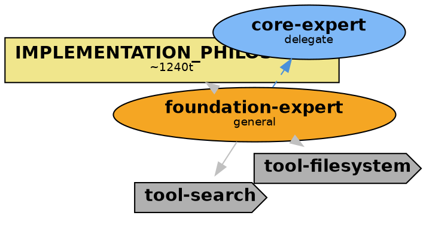
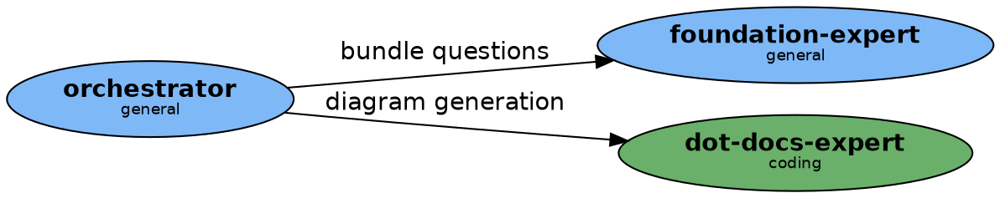

# Agent-to-DOT Diagram Convention

## Purpose

Agent diagrams visualize two complementary views:

1. **Per-agent composition card** — a star layout showing what one agent is made of (tools, context, delegation targets)
2. **Topology overview** — `agents/TOPOLOGY.dot` + `agents/TOPOLOGY.png`, a delegation graph showing how all agents in the bundle relate to each other

---

## File Naming Convention

| Source file | DOT file | PNG file |
|-------------|----------|----------|
| `agents/my-expert.md` | `agents/my-expert.dot` | `agents/my-expert.png` |
| `agents/code-reviewer.md` | `agents/code-reviewer.dot` | `agents/code-reviewer.png` |
| *(all agents in bundle)* | `agents/TOPOLOGY.dot` | `agents/TOPOLOGY.png` |

**Rule:** Same filename, different extension for per-agent cards. `TOPOLOGY.dot` is the one aggregated file per `agents/` directory.

---

## Diagram Type 1: Per-Agent Composition Card (Star Layout)

Each agent gets a star diagram with the agent at the center and spokes radiating out to its dependencies.

### Visual Conventions

| Element | Shape | Fill color | Notes |
|---------|-------|------------|-------|
| Central agent node | `ellipse` | `#F5A623` (orange) | The agent being diagrammed |
| Tool/module | `cds` | `#B0B0B0` (grey) | `tools:` entries in frontmatter |
| Context file | `note` | `#F0E68C` (khaki) | `@mentions` in agent body |
| Delegation target agent | `ellipse` | `#7EB8F7` (light blue) | Agents mentioned in description/body |
| Provider constraint | `parallelogram` | `#E8E8E8` (light grey) | `provider_preferences:` entries |

### Token Cost Annotations

Context nodes (notes) carry token cost annotations using the same formula as bundle diagrams:

**Estimation:** `token_estimate = len(file_content) // 4`

```dot
"context/bundle-awareness.md" [
  shape=note, fillcolor="#F0E68C",
  label=<<B>bundle-awareness</B><BR/><FONT POINT-SIZE="9">~310t</FONT>>
]
```

### Edge Styles

| Relationship | Style |
|-------------|-------|
| Agent → Tool | solid arrow, grey |
| Agent → Context | dotted arrow, grey |
| Agent → Delegation target | dashed arrow, blue |
| Agent → Provider | dotted arrow, light grey |

### Example Per-Agent DOT



---

## Diagram Type 2: Topology Overview (`agents/TOPOLOGY.dot`)

The topology diagram shows all agents in the bundle as nodes in a directed delegation graph.

### Visual Conventions

Nodes are colored by **`model_role`**:

| model_role | Fill color |
|------------|-----------|
| `general` | `#7EB8F7` (blue) |
| `coding` | `#6AAF6A` (green) |
| `fast` | `#B0E0B0` (light green) |
| `reasoning` | `#9B7FD4` (purple) |
| `writing` | `#F5A623` (orange) |
| `research` | `#F0E68C` (yellow) |
| *(unknown/unset)* | `#E0E0E0` (grey) |

Edges represent **delegation relationships** inferred from agent descriptions and `<example>` blocks. An edge `A → B` means "agent A delegates to agent B."

### Example Topology DOT



---

## Freshness Model

Same mechanism as bundle diagrams. Each per-agent `.dot` embeds a hash of its source `.md` file:

```dot
// source_hash: sha256:a3f2c1...
// generated: 2025-06-15T10:22:01Z
```

`validate-agents` reads these comment lines, recomputes `sha256(agent_content)`, and regenerates the DOT+PNG if stale. `TOPOLOGY.dot` has no source hash (it aggregates all agents); it is regenerated whenever any agent in the directory changes.

---

## Generation

### Automatic (via validation recipes)

`validate-agents` regenerates stale or missing diagrams as a side effect of validation:

```
validate-agents → detects missing/stale → calls generate-agent-docs
```

By default, `generate-agent-docs` requests **LLM-enhanced labels** — node labels are rewritten with concise, accessible English summaries.

To skip LLM enhancement (structural-only, faster):

```yaml
# In recipe context
enhance_diagrams: "false"
```

### Direct (bulk generation)

```
generate-agent-docs
```

Scans the `agents/` directory, regenerates all per-agent `.dot` + `.png` pairs, and regenerates `TOPOLOGY.dot` + `TOPOLOGY.png`.

---

## Lifecycle: When to Regenerate

### Per-agent composition card

Regenerate when any of these change in the agent's `.md` file:

- `meta.description` (delegation targets inferred from here)
- `tools:` list
- `model_role`
- `@mentions` in the agent body (context files change)
- `provider_preferences:`
- The agent's system instruction text (significant rewrites)

### TOPOLOGY.dot

Regenerate when any agent in the `agents/` directory is:

- Added or removed
- Has its `model_role` changed
- Has its delegation patterns changed

**Tip:** Run `validate-agents` — it checks hashes and regenerates only what's stale, then regenerates TOPOLOGY if any card changed.

---

## Checklist

Before committing an agent change:

- [ ] Co-located `.dot` + `.png` exist alongside the agent `.md` file
- [ ] `source_hash` comment in the per-agent DOT matches current agent content (or run `validate-agents`)
- [ ] Token cost labels are present on context (@mention) nodes
- [ ] `agents/TOPOLOGY.dot` + `agents/TOPOLOGY.png` reflect the current agent roster
- [ ] LLM-enhanced labels are used (or `enhance_diagrams: "false"` is intentional)
