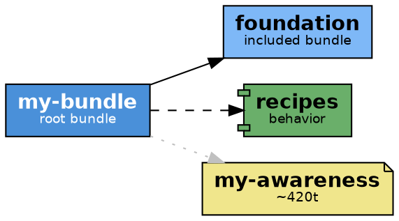

# Bundle-to-DOT Diagram Convention

## Purpose

Every bundle (`bundle.md`) and behavior YAML gets a co-located pair of files:

```
bundle.md           → bundle.dot  +  bundle.png
my-behavior.yaml    → my-behavior.dot  +  my-behavior.png
```

These diagrams are **composition cards** — they visualize which bundles, behaviors, agents, context files, tools, and hooks a bundle assembles, annotated with token cost so readers can reason about context budget at a glance.

---

## File Naming Convention

| Source file | DOT file | PNG file |
|-------------|----------|----------|
| `bundle.md` | `bundle.dot` | `bundle.png` |
| `behaviors/my-capability.yaml` | `behaviors/my-capability.dot` | `behaviors/my-capability.png` |
| `behaviors/code-review.yaml` | `behaviors/code-review.dot` | `behaviors/code-review.png` |

**Rule:** Same filename, different extension. DOT and PNG are siblings of the source file.

---

## Visual Conventions

### Node Types → Shapes and Colors

| Element | Shape | Fill color | Notes |
|---------|-------|------------|-------|
| Bundle (root) | `box` | `#4A90D9` (blue) | The file being diagrammed |
| Included bundle | `box` | `#7EB8F7` (light blue) | `includes:` entries |
| Behavior | `component` | `#6AAF6A` (green) | `behaviors:` entries |
| Agent | `ellipse` | `#F5A623` (orange) | Agent `.md` files |
| Context file | `note` | `#F0E68C` (khaki) | `context.include:` entries |
| Tool/module | `cds` | `#B0B0B0` (grey) | `tools:` entries |
| Hook | `hexagon` | `#D9A0D9` (lavender) | `hooks:` entries |

### Edge Styles

| Relationship | Style |
|-------------|-------|
| `includes:` | solid arrow |
| `behaviors:` | dashed arrow |
| `agents.include:` | dotted arrow |
| `context.include:` | dotted arrow, grey |
| `tools:` | solid arrow, grey |
| `hooks:` | solid arrow, lavender |

### Token Cost Annotations

Token cost tiers appear as labels on context/agent nodes:

| Tier | Estimated tokens | Label suffix |
|------|-----------------|--------------|
| Tiny | < 500 | `~Xt` |
| Small | 500–2 000 | `~Xt` |
| Medium | 2 000–8 000 | `~Xt` |
| Large | > 8 000 | `~Xt ⚠` (warning flag) |

**Estimation formula:** `token_estimate = len(file_content) // 4`

Token labels are added as a subtitle inside HTML-like labels:

```dot
"context/bundle-awareness.md" [
  shape=note,
  label=<<B>bundle-awareness</B><BR/><FONT POINT-SIZE="9">~310t</FONT>>,
  fillcolor="#F0E68C"
]
```

---

## Freshness Model

To detect stale diagrams without re-reading every source file, the DOT embeds a hash of the source bundle/behavior at generation time:

```dot
// source_hash: sha256:a3f2c1...
// generated: 2025-06-15T10:22:01Z
digraph bundle {
  ...
}
```

**`validate-bundle-repo`** reads these comment lines and recomputes `sha256(source_content)`. If the stored hash differs, the diagram is stale and is regenerated automatically.

---

## Generation

### Automatic (via validation recipes)

`validate-bundle-repo` regenerates stale or missing diagrams as a side effect of validation:

```
validate-bundle-repo → detects missing/stale → calls generate-bundle-docs
```

By default, `generate-bundle-docs` requests **LLM-enhanced labels** — node labels are rewritten with concise, accessible English summaries rather than raw filenames.

To skip LLM enhancement (structural-only, faster):

```yaml
# In recipe context
enhance_diagrams: "false"
```

### Direct (bulk generation)

```
generate-bundle-docs
```

Scans the repo for all `bundle.md` and `behaviors/*.yaml` files and regenerates their `.dot` + `.png` pairs.

---

## Lifecycle: When to Regenerate

Regenerate a bundle or behavior diagram when any of these change:

- `includes:` list (which bundles are composed)
- `behaviors:` list (which behaviors are added)
- `agents.include:` list
- `context.include:` list (files added/removed/renamed)
- `tools:` list (modules added/removed)
- `hooks:` definitions
- The description/frontmatter of the bundle itself

**Tip:** If you're unsure, run `validate-bundle-repo` — it checks hashes and regenerates only what's stale.

---

## Example DOT Structure



---

## Checklist

Before committing a bundle or behavior change:

- [ ] Co-located `.dot` + `.png` exist alongside the source file
- [ ] `source_hash` comment in the DOT matches current source content (or run `validate-bundle-repo`)
- [ ] Token cost labels are present on context and agent nodes
- [ ] LLM-enhanced labels are used (or `enhance_diagrams: "false"` is intentional)
